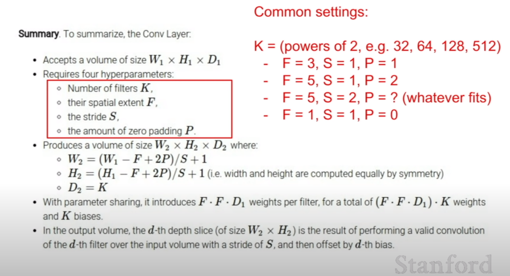
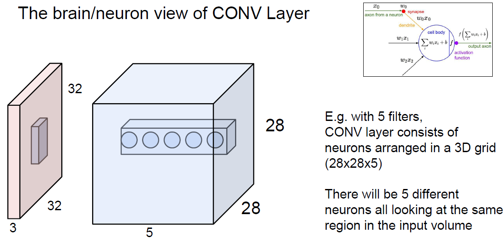
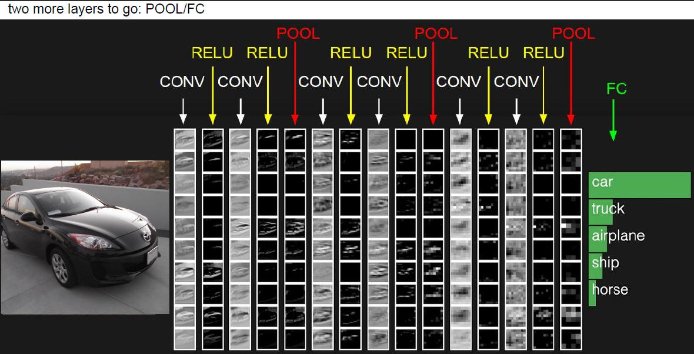
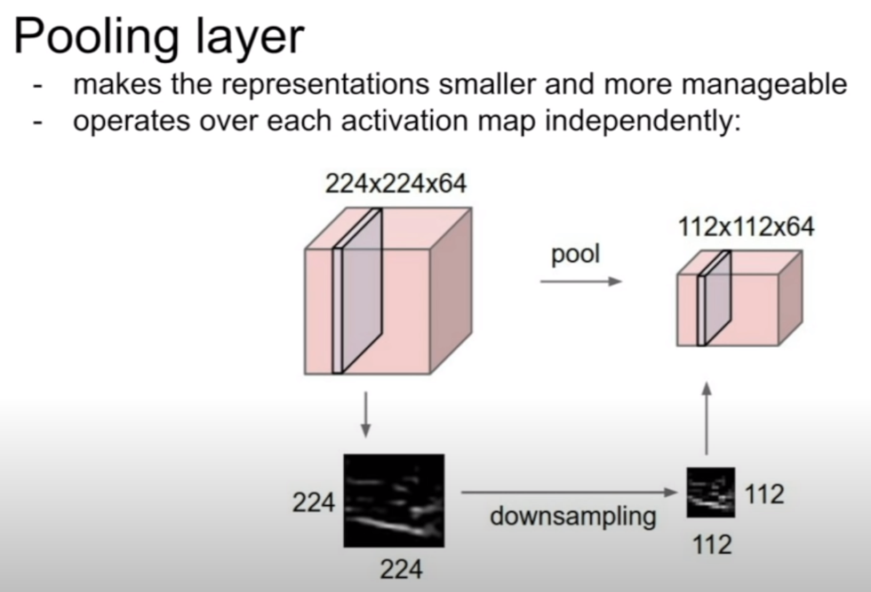
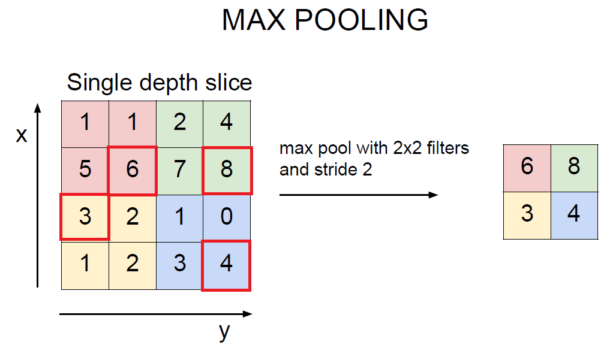
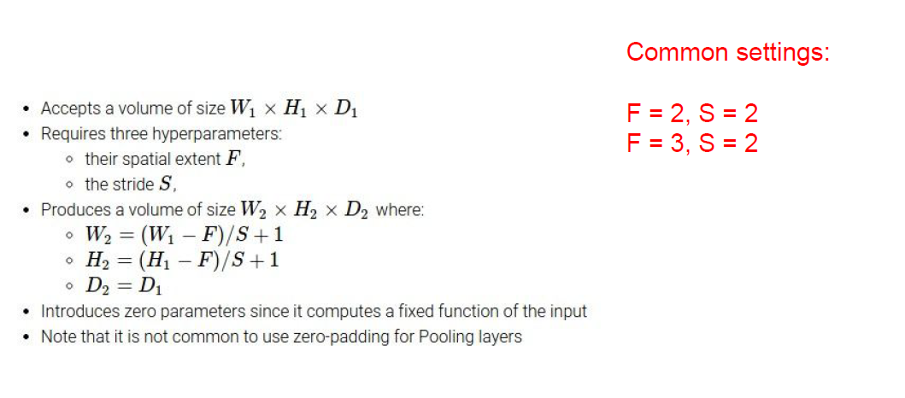

_Output size shall be number of filters_

Summary of Conv. Layer

Common setting :
- Number of filters(K) : power of 2 ( e.g. 32 , 64, 128, 512 ... )
- __F = 3, S = 1, P = 1__
- __F = 5, S = 1, P = 2__
- F = 5, S = 2, P = ? (Whatever fits)
- F = 1, S = 1, P = 0

### Q. What's the intuition behind how you choose your stride.
- it's kind of resolution control. ( more stride, more downsizing )
- similar with pooling in sense, but different.
- impacts on *# of parameters, size of model, overfittings..*. considering trade off.

one notable point is, this Conv net and Neural net only locally connected

### __Example of 5 filters__  
28 x 28 x 5 filter  
--> 5 different filters looking at same input region  

### __CNN overview__

### __Pooling Layer__
make representations smaller, manageable  

### __Max pooling__
One way of pooling. Commonly used than *Average pooling*.  
Cuz average pooling, model couldn't show performance at image overall. (*Because it's average..*)  
To check corner case of image, Max pooling is better approach.  

Recap 

[ConvNet Demo](http://cs.stanford.edu/people/karpathy/convnetjs/demo/cifar10.html)
