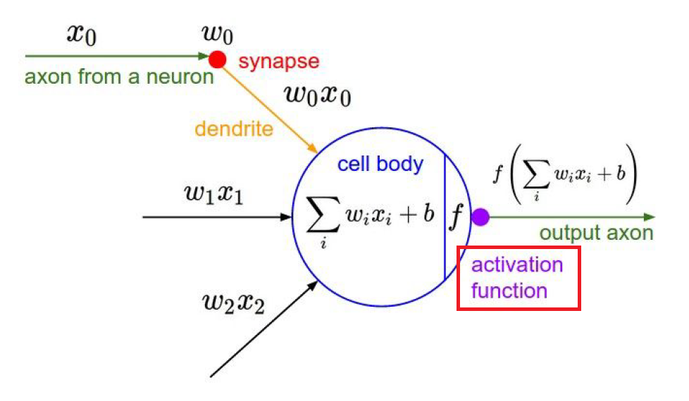
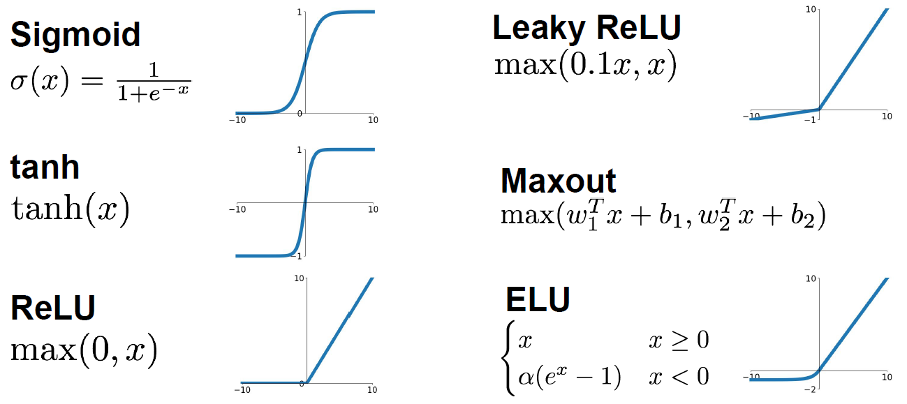
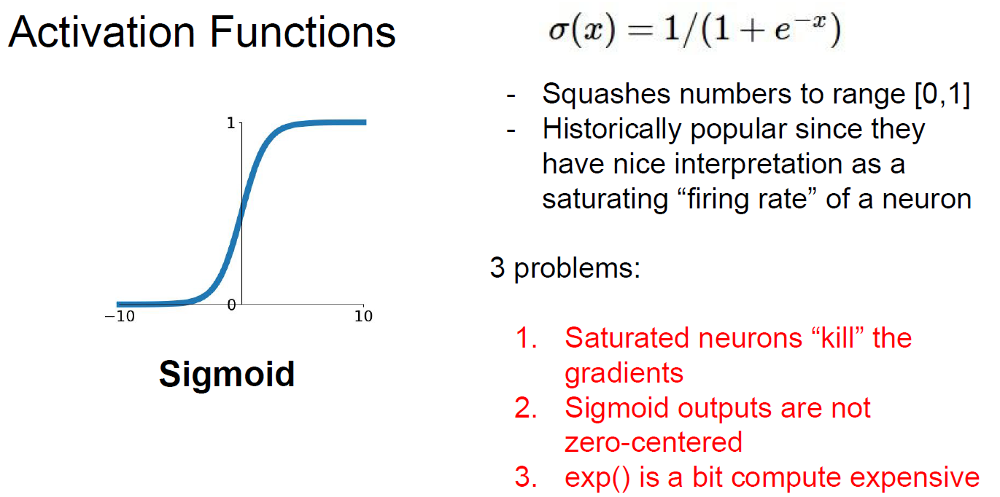
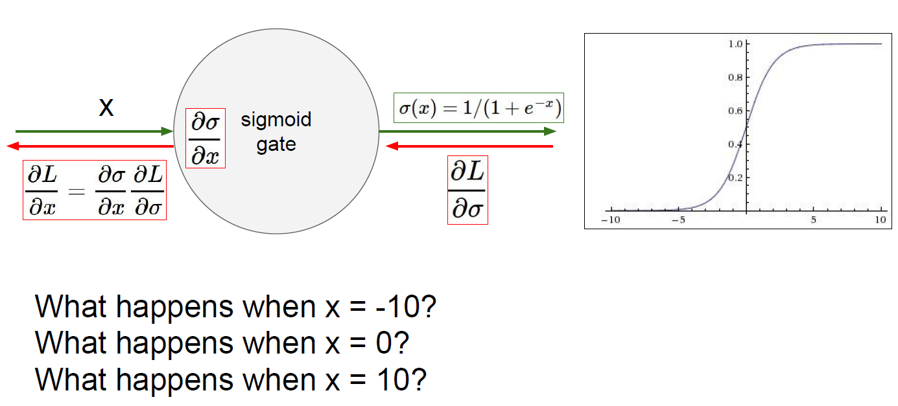
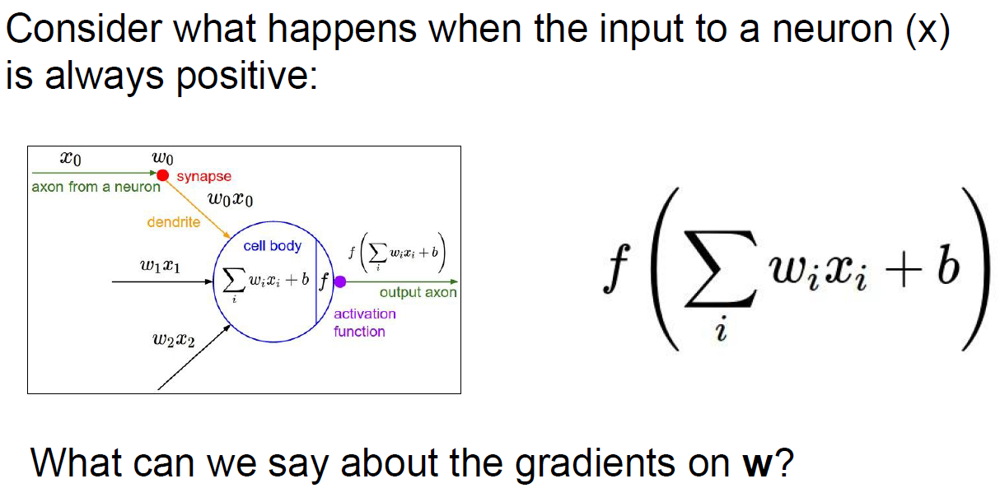

# Training Neural Networks I

*Let's begin to learn ..*

>    1.  __One time setup__  
        *activation functions, preprocessing, weight  
        initializing, regularization, gradient checking*
>    2.  __Training dynamics__  
        *babysitting the learning process,  
        parameter updates, hyperparameter optimization*
>    3.  __Evaluation__  
       *model ensembles*

 

## __Part 1__

- [Activation functions](#Activation-functions)
- [Data Preprocessing](#Data-Preprocessing)
- [Weight Initialization](#Weight-Initialization)
- [Batch Normalization](#Batch-Normalization)
- [Babysitting the Learning Process](#Babysitting-the-Learning-Process)
- [Hyperparameter Optimization](#Hyperparameter-Optimization)

 
   
### __1. Activation functions__  

at any of certain layer, inputs comes in and multiplied by some weight(w_i, plus bias)  
and then activate it by *__some of functions__*

the functions are.. 

### Sigmoid

Output always returns [0,1].  
Historically popular, since it have nice performance of saturating value.  
But have this have 3 known <b><i>Problems

<b><i>Problem 1  

When x = -10, gradient would be __0__  
When x = 0, gradient would be __fine(proper value for neural network..)__  
When x = 10, gradient would be __0__  

<b><i>Problem 2  

asd

<b><i>Problem 3  

asd
